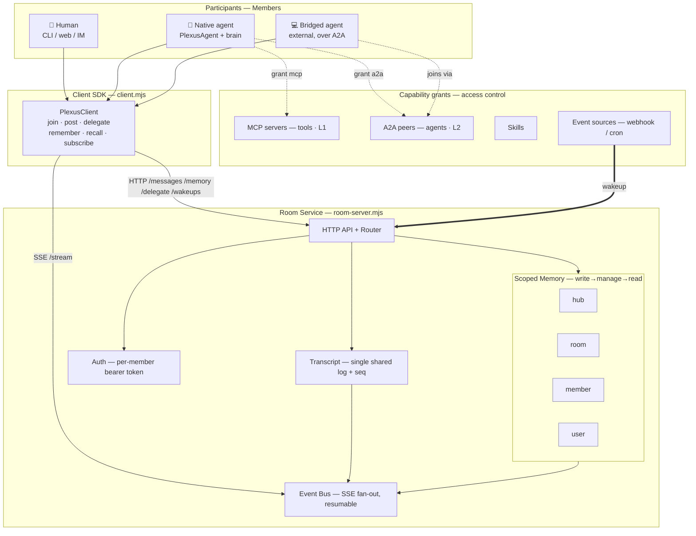

# Plexus

**A shared-context collaboration layer for Claude Code agents.**
Humans and agents meet in a *Room* — one shared transcript, one scoped memory,
one event bus — instead of N context-isolated threads that can't see each other.

> *plexus* (n.) — an interwoven network of nerves or vessels. The mesh, not the
> junction: many participants, one shared context.

---

## Abstract

LLM agent tooling in 2026 is excellent at two layers and silent on a third:

- **Vertical integration (agent ↔ tool)** is solved by **MCP**, the de-facto
  standard for connecting agents to tools.
- **Horizontal coordination (agent ↔ agent)** is converging on **A2A**: Agent
  Cards and task delegation across vendors.
- **Shared context (who-sees-what, collective memory)** has no standard. Agent
  SDKs run every subagent in its *own context-isolated session thread*; message
  passing alone doesn't define a shared, governed, durable conversation
  substrate.

A **Shared Context Store** reduces redundancy and enables knowledge transfer
across agents, and agent memory is best modeled as a **scoped
write→manage→read loop**.

**Plexus is that missing third layer, built for Claude Code.** It contributes one
primitive — the **Room** — and wires the existing two layers (MCP, A2A) and
Claude Code's own primitives (subagents, scoped file-memory, scheduled wakeups)
*into* it. The conversation, not the bot, is the unit of collaboration.

This repository is a **zero-dependency reference implementation** (pure Node ESM)
plus a runnable demo. It is small enough to read in one sitting and faithful
enough to show the model end-to-end. Swap the in-memory store for Postgres/Redis
and the stub brains for the Claude Agent SDK; the protocol does not change.

## Architecture



More views — three-layer thesis, memory scope lattice, runtime sequence, member
lifecycle — in [`docs/architecture-diagram.md`](docs/architecture-diagram.md).

## The model — five concepts

| Plexus | What it is | Built on |
| --- | --- | --- |
| **Hub** | Governance + access boundary; owns rooms and the broadest memory scope. | org/workspace boundary |
| **Room** | The shared runtime: one transcript + scoped memory + event bus. **The one new primitive.** | Shared Context Store |
| **Member** | A participant: `human`, `native` (a Claude Agent SDK subagent), or `bridged` (external agent over A2A). | Claude Agent SDK subagents; A2A |
| **Capability** | A grant: `mcp` (tool), `a2a` (peer agent), `skill`, `event_source`. Access is grant-based. | MCP + A2A two-layer stack |
| **Memory** | Scoped write→manage→read loop: `hub` ⊃ `room` ⊃ `member` ⊃ `user`. Reads resolve narrow→broad. | Claude Code scoped file-memory |
| **Wakeup** | An external event (webhook/cron) that wakes a Room. | Claude Code `/schedule`, hooks |

## What Plexus is *not* (and reuses instead)

It does **not** reimplement agents, tools, or per-agent memory. Those exist:
Claude Code already has subagents, MCP, Skills, scoped file-memory, and cron.
Plexus adds *only* the shared, governed conversation those primitives plug into.

## Quick start

```bash
cd ~/plexus
node examples/incident-room.mjs     # full demo, no API key, no npm install
# or run the service standalone:
node src/room-server.mjs            # http://localhost:7771
```

Expected demo output: a single shared transcript where a GitHub webhook wakes the
room, a `triage` agent records a hypothesis, a `fixer` agent reads it and delegates
a rollback (A2A) to a `laptop-runner`, which executes and reports — then the lesson
is promoted from room-scope to hub-scope for the next incident.

## Making a member a real Claude teammate

The only seam between this reference impl and a live model is one function:

```js
import { PlexusAgent } from './src/agent.mjs';
import { claudeBrain } from './src/agent.mjs';   // lazy-imports @anthropic-ai/claude-agent-sdk

new PlexusAgent({
  name: 'triage',
  brain: claudeBrain({ system: 'You triage incidents. One action per turn.', model: 'claude-sonnet-4-6' }),
});
```

`claudeBrain` renders the **shared** transcript into the prompt, so the Claude
subagent reasons over the whole Room — the exact thing the SDK's isolated session
threads cannot do alone.

## Files

```
src/protocol.mjs       roles, scopes, events, message/capability builders
src/room-server.mjs    the Room service: HTTP API + SSE bus + scoped memory store
src/client.mjs         PlexusClient: join / post / delegate / remember / recall / subscribe
src/agent.mjs          PlexusAgent + the claudeBrain() Agent-SDK seam
examples/incident-room.mjs   runnable end-to-end demo
docs/ARCHITECTURE.md   protocol, data model, scope lattice, scaling path
```

## Design principles

- **A layer, not an app.** Plexus standardizes one thing — the governed shared
  conversation — and stays embeddable rather than becoming a product to adopt.
- **Native MCP + A2A.** The two-layer interop stack is built in: tools via MCP,
  agent-to-agent delegation via A2A.
- **Memory as a scoped write→manage→read loop.**
- **Built for Claude Code.** Its subagents are the native members, its scoped
  file-memory is the memory backend, and its `/schedule` is the wakeup source.
