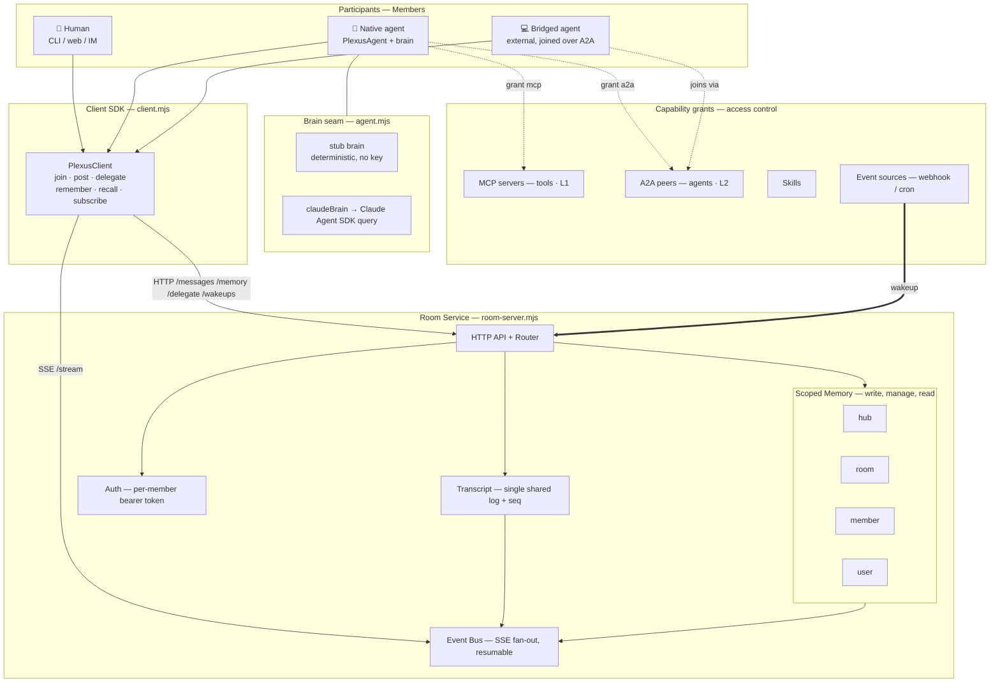
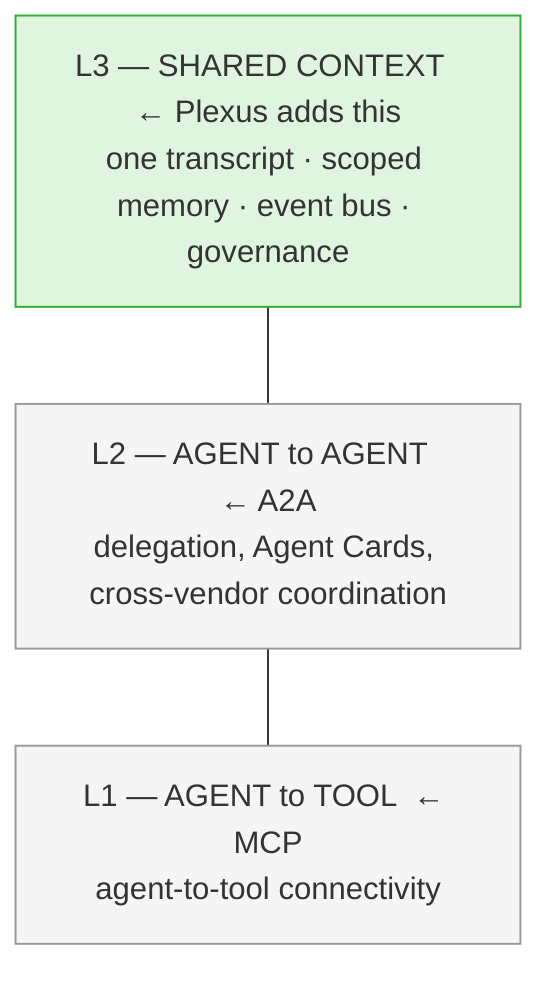
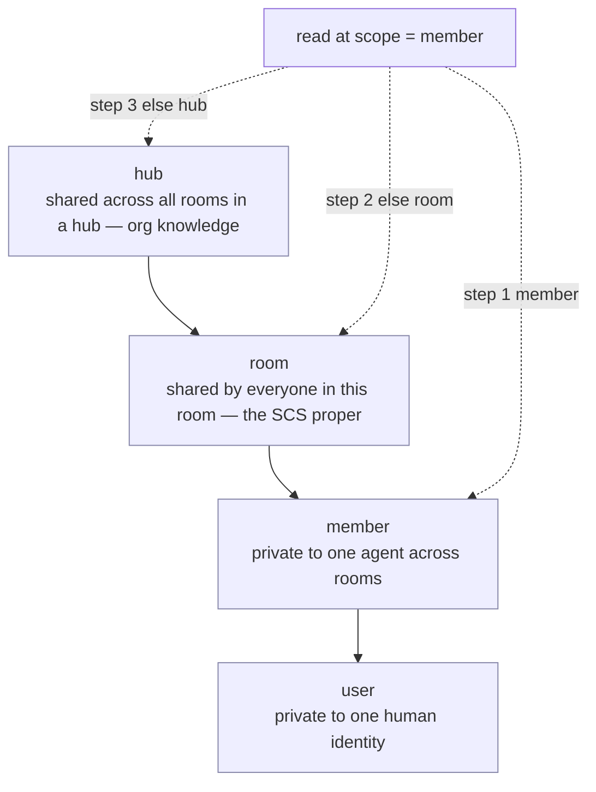
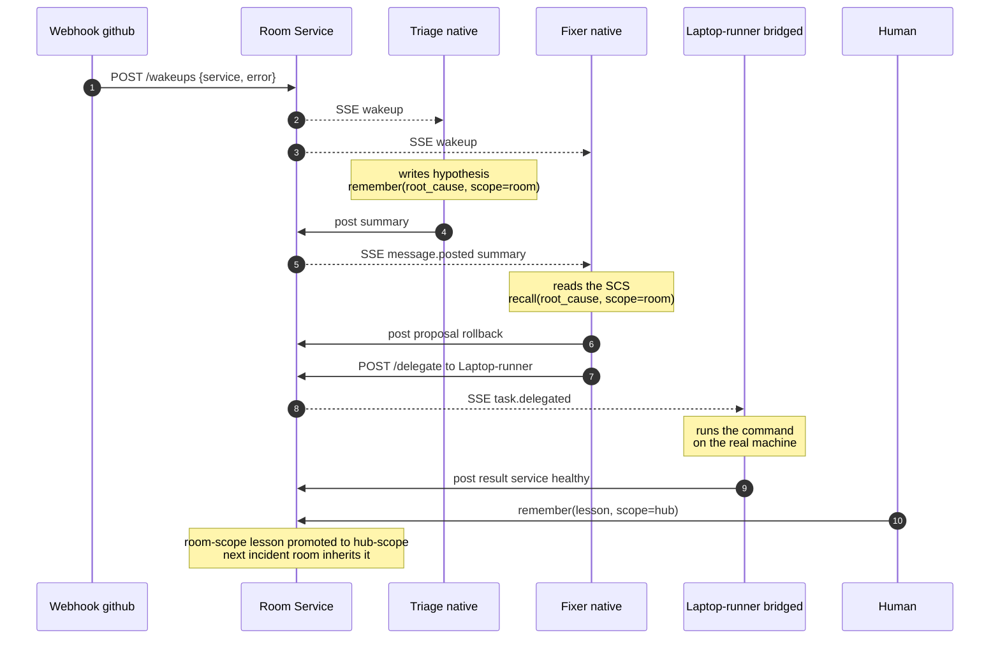
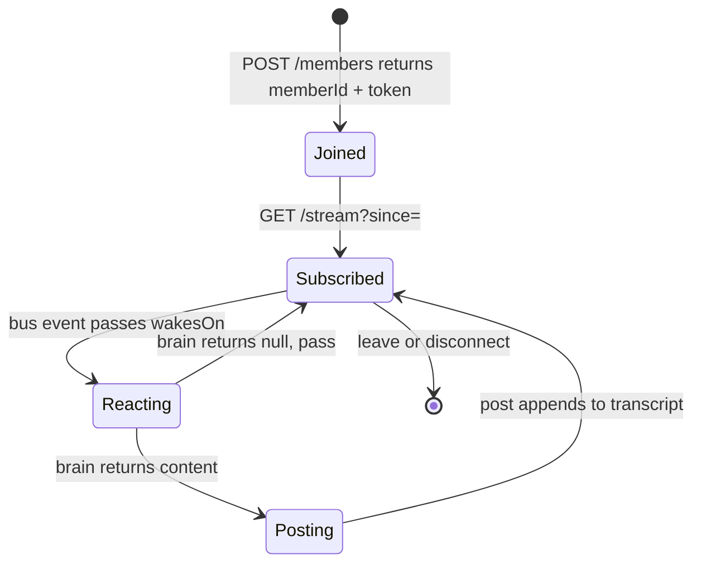

# Plexus — architecture diagrams

All diagrams are Mermaid and render directly on GitHub.

---

## 1. System architecture

How participants, the client SDK, the Room service, and the capability layer fit
together.

---

## 2. The three-layer thesis

Two layers already have standards; Plexus contributes the third.

---

## 3. Memory scope lattice

A write pins a key to one scope. A read resolves **narrow → broad**, so a private
note *shadows* a room default.

---

## 4. Runtime sequence — the incident room

End-to-end flow of `examples/incident-room.mjs`: every arrow into `R` is one
entry in the single shared transcript.

---

## 5. Member lifecycle

